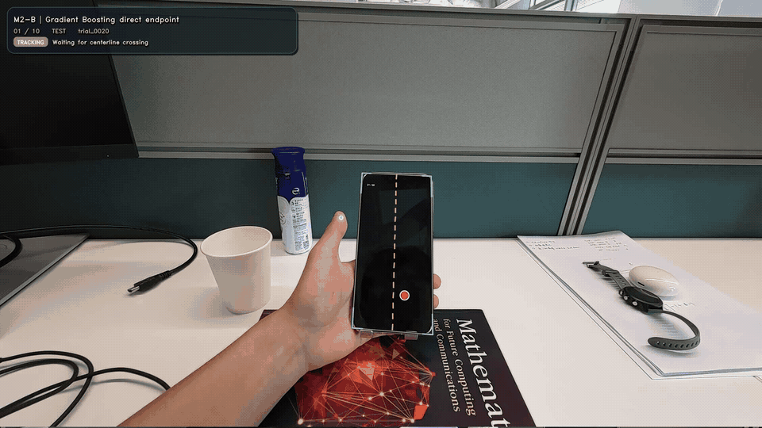

# visual_pretouch

视觉触摸前预测研究原型：在左手拇指越过手机屏幕中线时，预测它在右半屏的最终触点。

## 研究条件

当前研究固定使用 **Huawei Mate 80 Pro**（采集区域 1280×2832 px、70.6×156.2 mm），固定摄像头视角，并固定手机相对摄像头的摆放姿态。任务限定为单用户、左手拇指、左向右跨线、右半屏点击和离线处理。它验证视觉轨迹是否包含落点信息，不代表智能眼镜实时部署或跨用户能力。

仓库保留 Pura X、iPhone 16 的设备采集配置以兼容既有采集页面；当前研究目标样机是 Mate 80 Pro。历史 10-session 模型评估含 8 个 Mate 80 Pro session 和 2 个 Pura X session，因此应视为同一用户、混合设备条件下的开发结果。

## 完整 pipeline

```text
collect.html 采集触点与设备尺寸 + 摄像头录制
        ↓
每个 session 保存 touches CSV、session 元数据和原始视频
        ↓
MediaPipe Hands 0.10.14 提供拇指候选，LK 光流维持短时轨迹连续性
        ↓
本地 review 页面逐次审核拇指轨迹，并标注或继承屏幕四角
        ↓
白闪辅助触点与视频对齐；四角单应变换将拇指投影到归一化屏幕坐标
        ↓
只纳入触摸前恰好一次左→右跨线的保留 touch
        ↓
M2：跨线前因果特征 → 增量中位数 / Ridge / Gradient Boosting
M3：跨线前 300 ms 因果序列 → 小型单向 LSTM / GRU
        ↓
按 session 留一评估 → 毫米误差、hit@r、失败原因和可核查 demo
```

每次预测只读取跨线时及之前的信息。屏幕四角由 review 人工标注或沿用上一次有效标注；同一动作内使用同一变换。M1 的真实剩余时间 baseline 是事后 oracle 对照，不作为因果模型成绩。

## 当前结果

M2 与 M3 使用相同的 10-session、`single_only` leave-one-session-out（LOSO）协议，共 218 个协议有效 touch。下表是 10 个 session 指标的宏平均；误差单位为 mm，命中率在成功预测样本上计算。

| 方法 | mean error | median error | hit@10 | hit@15 | hit@20 |
| --- | ---: | ---: | ---: | ---: | ---: |
| M2 训练集增量中位数 | 14.90 | 13.60 | 33.1% | 54.8% | 73.2% |
| M2 Model A · Ridge | 14.59 | 13.30 | 47.5% | 72.2% | 85.8% |
| M2 Model B · Gradient Boosting | **10.87** | **9.28** | **54.0%** | **80.8%** | **91.2%** |
| M3 · tiny LSTM | 11.85 | 11.01 | 45.4% | 67.1% | 87.9% |
| M3 · tiny GRU | 11.84 | 10.23 | 50.8% | 70.9% | 86.6% |

在当前数据上，Gradient Boosting 整体最好。LSTM 有 1/10、GRU 有 4/10 个 session 的 median error 不高于 Gradient Boosting，未达到预设的时序模型复核门槛，因此没有扩大网络或追加随机种子。结果细节、排除数和协议见 [实验记录](docs/EXPERIMENTS.md)。

这些数值来自同一用户的小规模开发集，不能解释为跨用户或独立设备泛化性能。旧 `m2-baseline` tag 使用较早的跨线筛选规则；当前表格采用 `single_only`，两种协议的历史结果不要直接混比。

## M2 可视化 demo



上方是 Huawei Mate 80 Pro 会话中 M2 Model B 的慢放可视化预览，展示拇指轨迹和跨线时生成的预测点。它用于查看渲染效果；量化结论请看上方当前 `single_only` LOSO 结果表。

## 快速开始

需要 Python 3.11、FFmpeg 可读的视频，以及仓库要求的依赖。推荐使用 `visual_pretouch` conda 环境：

```bash
conda create -n visual_pretouch python=3.11 -y
conda activate visual_pretouch
python -m pip install -r requirements.txt
```

采集时打开 `collect.html`，选择设备并导出触点记录；将原始视频和采集文件放到 `dataset/session_example/`。原始数据、审核缓存和实验输出不提交到 Git。

对 session 做追踪准备和人工 review：

```bash
python scripts/review_session.py --session-dir dataset/session_example
```

页面保存保留／舍弃结果到该 session 的 `review.csv`，屏幕角点保存到 `calibration.json`。如果还没有相应输入，工具会按当前配置准备追踪与白闪信息。新增 session 后，先把 session 名加入 `config.yaml:data_split`，并完成 review 和屏幕角点标注，再运行当前 `single_only` LOSO 量化：

```bash
python scripts/m2_all_sessions.py \
  --output-root outputs/m2_single_cross_loso_run01
```

M2 runner 对 `config.yaml` 中配置的 10 个 session 逐一留一测试，不渲染视频。将它生成的目录传给 M3，完成配对的 LSTM／GRU 评估：

```bash
python scripts/m3_sequence_models.py \
  --m2-root outputs/m2_single_cross_loso_run01 \
  --output outputs/m3_sequence_models_run01
```

示例目录必须尚不存在；再次运行时请给目录名换一个后缀，实验输出不会覆盖。运行一个 M2 视频 demo（默认渲染，`--last-n 10` 只显示末 10 次）：

```bash
python scripts/m2_endpoint_models.py \
  --test-session session_20260917075744362_8 \
  --last-n 10 \
  --output outputs/m2_demo_run01
```

现有预测表或实验目录可用量化工具查看毫米误差和 hit@r：

```bash
python scripts/baseline_metrics.py outputs/m2_demo_run01
```

## 仓库结构

```text
collect.html                 触点采集页面
config.yaml                  设备参数、划分、模型与渲染超参数
scripts/                     review、M1/M2/M3 评估和通用离线 pipeline
tests/                       自动化测试
docs/PROJECT_CONTEXT.md      研究问题、P0 范围和非目标
docs/ARCHITECTURE.md         模块边界与信息流
docs/DATA.md                 坐标、时间、字段和数据契约
docs/DECISIONS.md            决策理由与待定问题
docs/EXPERIMENTS.md          协议、指标与结果登记
```

## 可复现与限制

- 所有模型超参数集中在 `config.yaml`；每次运行使用新输出目录，并记录配置及输入身份。
- M2/M3 的 LOSO 量化通过无渲染路径运行，不必生成视频。
- 自动化测试：`python -m unittest discover -s tests -v`。
- `outputs/`、采集数据、session 审核结果和追踪缓存是本地数据，不纳入 Git；需要复现实验时，先准备同一批 session 文件。
- 固定视角和静态手机姿态是当前假设。屏幕映射依赖人工四角标注；手部被手机遮挡时，MediaPipe / 光流仍可能漏检或漂移，需人工审核。
- 现有数据量小，参与者单一；毫米误差还受白闪对齐不确定性影响。

更多命令和方法定义见 [架构说明](docs/ARCHITECTURE.md)、[数据约定](docs/DATA.md)、[决策记录](docs/DECISIONS.md) 与 [实验记录](docs/EXPERIMENTS.md)。
